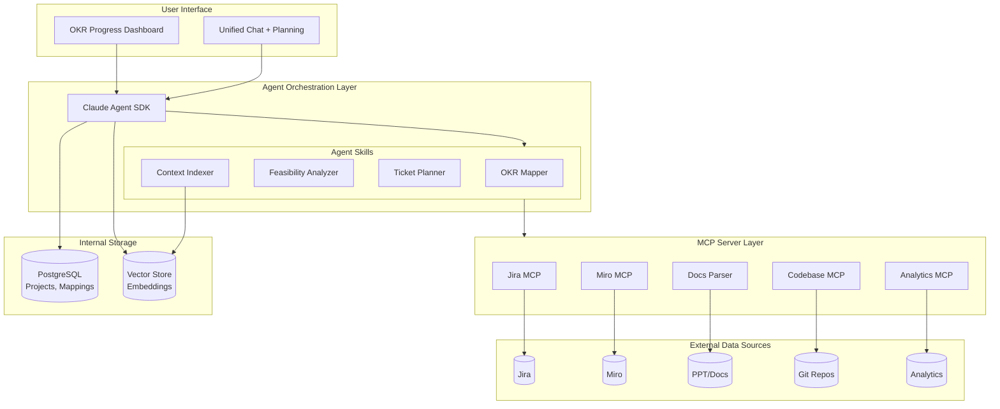
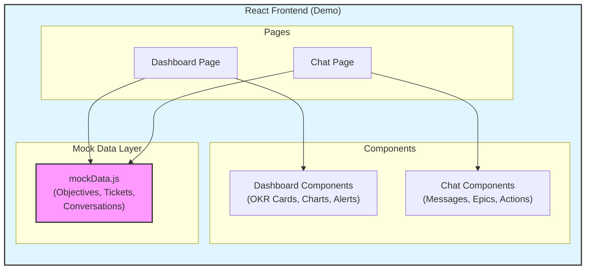
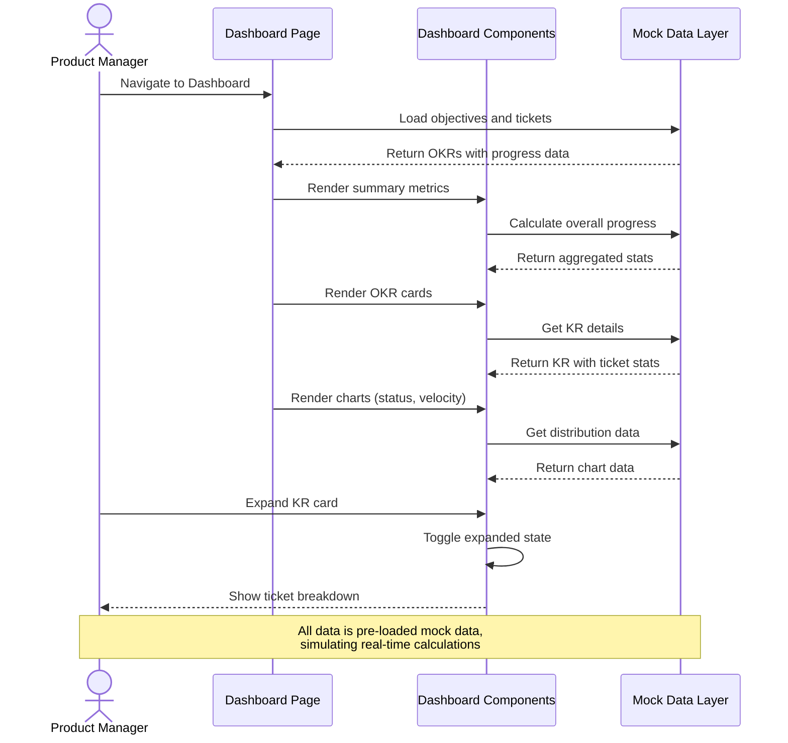
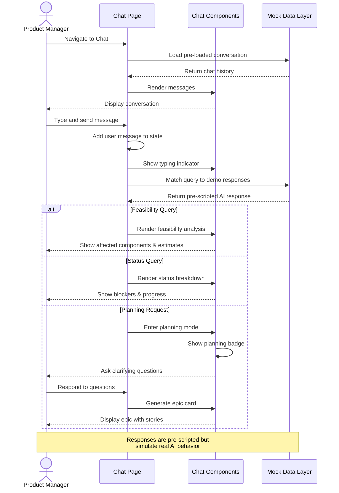
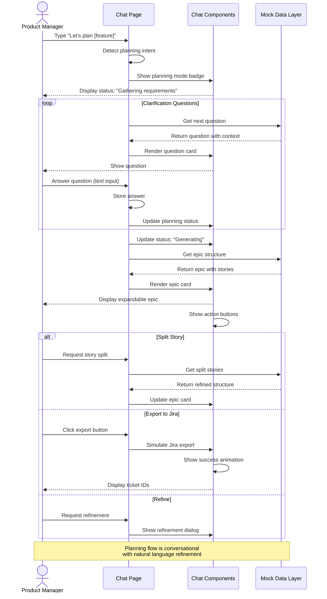
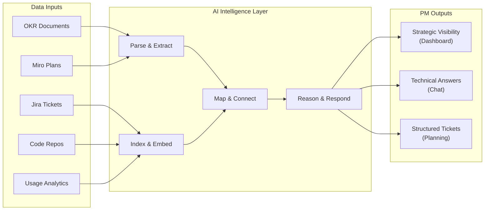
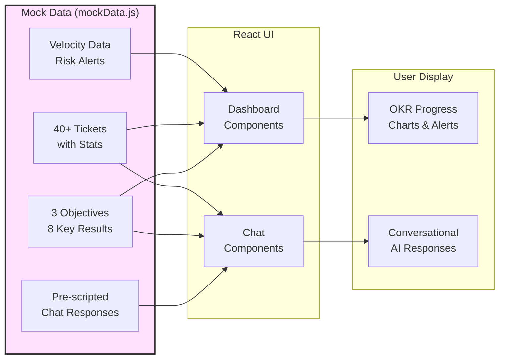

# Nexus: Vision Document

## The Problem

Product Managers are the connective tissue between strategy and execution. Yet they operate in a world of fragmented tools and disconnected information:

**Strategic artifacts live in isolation.** OKRs are locked in slide decks and documents. Roadmaps exist as static images in Miro. There's no live connection between "what we said we'd achieve" and "what we're actually building."

**Technical feasibility is a black box.** When a PM wants to know "Can we add feature X? How hard would it be?" - the answer requires scheduling meetings, waiting for engineering bandwidth, and often getting rough guesses rather than informed estimates. This creates bottlenecks and delays in decision-making.

**Planning is manual and error-prone.** Breaking down a feature into epics, stories, and tasks is time-consuming. PMs often miss edge cases that engineers would catch, leading to incomplete tickets that require rework and back-and-forth.

**Progress tracking is retrospective, not real-time.** By the time a PM realizes an OKR is at risk, it's often too late. The connection between daily ticket movement and quarterly objectives is maintained manually, if at all.

---

## The Vision

**Nexus** is an intelligent copilot that gives Product Managers superpowers by unifying their strategic context, execution data, and technical reality into a single conversational interface.

Imagine a PM who can:

- See at a glance how every ticket in flight maps to their OKRs
- Ask "What would it take to add SSO support?" and get a grounded answer in minutes, not days
- Break down a feature into well-structured tickets through a collaborative dialogue with an AI that actually understands the codebase
- Get early warnings when execution is drifting from strategy

This isn't about replacing PM judgment - it's about removing the friction that slows it down.

---

## What We're Building

### 1. Unified Context Layer

The tool ingests and connects information from across the PM's ecosystem:

| Source | What It Provides |
|--------|------------------|
| OKR Documents (PPT, Docs, PDF) | Strategic objectives, key results, success metrics |
| Miro / Visual Planning Tools | Roadmaps, user flows, architectural diagrams |
| Jira / Ticket Systems | Epics, stories, tasks, status, descriptions, history |
| Analytics Platforms | Usage data, funnel metrics, adoption numbers |
| Code Repositories | Service structure, APIs, dependencies, complexity |

This isn't just data aggregation - the AI understands the relationships between these artifacts and can reason across them.

---

### 2. OKR Progress Dashboard

A living view of strategic progress grounded in execution reality.

**Example Dashboard View:**

```
┌────────────────────────────────────────────────────────────────────────────────┐
│  PayFlow Q1 2025 OKRs                                    Last sync: 2m ago     │
├────────────────────────────────────────────────────────────────────────────────┤
│                                                                                │
│  ╔═══════════════════════════════════════════════════════════════════════╗    │
│  ║  SUMMARY METRICS                                                      ║    │
│  ╠═══════════════════════════════════════════════════════════════════════╣    │
│  ║  Overall Progress: 58%  │  At Risk: 2 KRs  │  Blocked: 3 tickets      ║    │
│  ║  Total Tickets: 40      │  Done: 24        │  In Progress: 11         ║    │
│  ╚═══════════════════════════════════════════════════════════════════════╝    │
│                                                                                │
│  ┌─ STATUS DISTRIBUTION ────┐  ┌─ SPRINT VELOCITY ─────────────────────┐     │
│  │                           │  │                                        │     │
│  │     Done: 24 (60%) ███    │  │  60 ┤                         ▓       │     │
│  │  In Prog: 11 (28%) ██     │  │  50 ┤            ▓       ▓    ░       │     │
│  │  Blocked:  3 (7%)  █      │  │  40 ┤     ▓      ░       ░    ░       │     │
│  │Not Start:  2 (5%)  █      │  │  30 ┤                                 │     │
│  │                           │  │     └─────────────────────────────    │     │
│  └───────────────────────────┘  │      S21   S22   S23   S24            │     │
│                                  │      ▓ Completed  ░ Planned           │     │
│                                  └────────────────────────────────────────┘     │
│                                                                                │
│  ◉ Objective 1: Improve payment success rate and reliability                  │
│    ├─ KR1: Increase payment success rate from 94% to 97%                      │
│    │   Progress: 75% ███████████████░░░░░  Current: 96.25% / Target: 97%     │
│    │   📊 12 tickets: 8 done • 3 in progress • 1 blocked                      │
│    │   ✅ Status: ON TRACK                                                    │
│    │                                                                           │
│    ├─ KR2: Reduce payment processing time from 2.5s to 1.5s                   │
│    │   Progress: 60% ████████████░░░░░░░░  Current: 1.9s / Target: 1.5s      │
│    │   📊 8 tickets: 5 done • 2 in progress • 1 not started                   │
│    │   ✅ Status: ON TRACK                                                    │
│    │                                                                           │
│    └─ KR3: Achieve 99.95% uptime for payment gateway                          │
│        Progress: 92% ██████████████████░░  Current: 99.93% / Target: 99.95%  │
│        📊 6 tickets: 5 done • 1 in progress                                   │
│        ✅ Status: ON TRACK                                                    │
│                                                                                │
│  ◉ Objective 2: Enable enterprise-grade security and compliance               │
│    ├─ KR1: Complete SOC 2 Type II certification                               │
│    │   Progress: 45% █████████░░░░░░░░░░░  Current: 45% / Target: 100%       │
│    │   📊 9 tickets: 2 done • 3 in progress • 2 blocked • 2 not started       │
│    │   ⚠️  Status: AT RISK                                                    │
│    │   🚫 SEC-204 blocked: Waiting for HR integration (4 days)                │
│    │                                                                           │
│    └─ KR2: Implement SSO for enterprise customers                             │
│        Progress: 30% ██████░░░░░░░░░░░░░░  Current: 30% / Target: 100%       │
│        📊 7 tickets: 1 done • 2 in progress • 1 blocked • 3 not started       │
│        ⚠️  Status: AT RISK                                                    │
│        🚫 AUTH-304 blocked: Dependency on user service refactor (3 days)      │
│                                                                                │
│  ◉ Objective 3: Scale merchant onboarding and activation                      │
│    ├─ KR1: Reduce time-to-first-transaction from 3 days to 1 day              │
│    │   Progress: 85% █████████████████░░░  Current: 1.3 days / Target: 1 day │
│    │   📊 10 tickets: 8 done • 2 in progress                                  │
│    │   ✅ Status: ON TRACK                                                    │
│    │                                                                           │
│    ├─ KR2: Increase merchant activation rate from 65% to 80%                  │
│    │   Progress: 20% ████░░░░░░░░░░░░░░░░  Current: 68% / Target: 80%        │
│    │   📊 4 tickets: 0 done • 1 in progress • 3 not started                   │
│    │   ⚠️  Status: BEHIND SCHEDULE                                            │
│    │                                                                           │
│    └─ KR3: Launch self-service onboarding portal                              │
│        Progress: 0% ░░░░░░░░░░░░░░░░░░░░  Current: 0% / Target: 100%         │
│        📊 0 tickets linked                                                    │
│        ⚠️  GAP: No execution items mapped to this KR                          │
│                                                                                │
└────────────────────────────────────────────────────────────────────────────────┘
```

**What the dashboard enables:**

- **Summary Metrics**: At-a-glance view of overall progress, risks, and ticket distribution
- **Visual Analytics**: Status distribution pie chart and sprint velocity trends
- **Auto-mapping**: Tickets to OKRs based on semantic understanding of descriptions
- **Real-time Progress**: Live calculation from ticket status across Jira boards
- **Risk Detection**: Automatically identifies blocked items, velocity drops, and scope issues
- **Gap Analysis**: Highlights OKRs with insufficient execution coverage
- **Drill-down**: Click any KR to see linked tickets, assignees, and detailed history

---

### 3. Code-Aware Chat Interface

A conversational interface where PMs can ask questions and get answers grounded in the actual codebase, tickets, and plans.

**Chat Window:**

```
┌────────────────────────────────────────────────────────────────────────┐
│  💬 Code-Aware Chat                                    [PayFlow]        │
├────────────────────────────────────────────────────────────────────────┤
│                                                                        │
│  [🤖 AI] Welcome! I have context of your codebase, Jira tickets,      │
│          and OKRs. Ask me about feasibility, impact, or status.       │
│                                                                        │
│  ─────────────────────────────────────────────────────────────────    │
│                                                                        │
│  [You] Can we add cryptocurrency payments? What would that involve?   │
│                                                                   10:23│
│                                                                        │
│  [🤖 AI] Based on the codebase analysis, adding cryptocurrency        │
│          payment support would be a significant undertaking.          │
│          Here's what it would involve:                           10:23│
│                                                                        │
│          AFFECTED COMPONENTS                                          │
│          • payment-service (src/services/payment/)                    │
│          • transaction-service (src/services/transaction/)            │
│          • accounting-service (src/services/accounting/)              │
│          • merchant-dashboard (src/apps/dashboard/)                   │
│                                                                        │
│          NEW INFRASTRUCTURE NEEDED                                    │
│          • Crypto wallet integration (Coinbase Commerce, BitPay)      │
│          • Real-time price conversion service                         │
│          • Blockchain transaction monitoring                          │
│          • Separate settlement flow (10+ min vs instant)              │
│                                                                        │
│          ESTIMATED EFFORT                                             │
│          • Engineering: 12-16 weeks for 2 engineers                   │
│          • Compliance review: 4-6 weeks                               │
│          • Total: ~5 months for MVP                                   │
│                                                                        │
│          💡 RECOMMENDATION                                            │
│          This is a major initiative requiring dedicated focus.        │
│          Validate demand with top 20 merchants first.                 │
│                                                                        │
│  [You] That's helpful. What's currently blocking the SSO work?        │
│                                                                   10:25│
│                                                                        │
│  [🤖 AI] Looking at the SSO epic (AUTH-301 to AUTH-304), there's      │
│          one blocker:                                            10:25│
│                                                                        │
│          🚫 AUTH-304: Implement JIT user provisioning                 │
│             Status: BLOCKED (3 days)                                  │
│             Assignee: Marcus Johnson                                  │
│             Blocker: "Dependency on user service refactor"            │
│             Related: USER-156 (in progress, due Sprint 25)            │
│                                                                        │
│          The user-service refactor is 60% complete. Looking at        │
│          the code:                                                    │
│                                                                        │
│          ┌──────────────────────────────────────────────┐             │
│          │ // src/services/user/userService.ts          │             │
│          │ // TODO: Update createUser() to support      │             │
│          │ // external identity providers               │             │
│          │ export async function createUser(data) {     │             │
│          │   // Current: email/password only            │             │
│          │   return User.create(data);                  │             │
│          │ }                                             │             │
│          └──────────────────────────────────────────────┘             │
│                                                                        │
│          💡 ACTION ITEM                                               │
│          Sync with Sarah (working on USER-156) to unblock Marcus.     │
│          Expected resolution: Sprint 24 (current sprint).             │
│                                                                        │
├────────────────────────────────────────────────────────────────────────┤
│  Type your question...                                  [Send]         │
└────────────────────────────────────────────────────────────────────────┘
```

**Example Conversation 1: Feasibility Check**

```
PM: Can we add dark mode to the customer dashboard?

AI: Based on the codebase analysis, here's what dark mode would involve:

AFFECTED COMPONENTS:
• Dashboard UI (src/components/dashboard/) - 23 components
• Design system tokens (src/styles/tokens.ts) - currently hardcoded colors
• Chart library (using Recharts) - would need theme prop updates

CURRENT STATE:
The app doesn't have a theming system. Colors are defined inline or in 
scattered CSS files. There's no CSS variable infrastructure.

ESTIMATED EFFORT:
• If we add a proper theming system first: 2-3 weeks (recommended)
• If we do a quick pass with CSS overrides: 1 week (tech debt)

DEPENDENCIES:
• No backend changes required
• Would need design assets for dark color palette

Do you want me to break this down into a detailed epic structure?
```

**Example Conversation 2: Impact Analysis**

```
PM: We're thinking of deprecating the /api/v1/users endpoint. 
    What would break?

AI: I found 3 internal services and the mobile app consuming this endpoint:

INTERNAL CONSUMERS:
1. notification-service (src/services/notifications/userLookup.ts)
   - Calls GET /api/v1/users/{id} for user preferences
   - 847 calls/day average

2. billing-service (src/services/billing/customerSync.ts)  
   - Calls GET /api/v1/users?email={email} for customer matching
   - 2,100 calls/day average

3. analytics-pipeline (jobs/daily_user_export.py)
   - Bulk export via GET /api/v1/users with pagination
   - Runs nightly

EXTERNAL CONSUMERS:
• Mobile app v2.3 and below still uses this endpoint
• Based on analytics, ~12% of mobile users are on these versions

RECOMMENDATION:
Consider a 90-day deprecation window with v2 migration path. 
The billing-service dependency is the most complex to migrate.
```

**Example Conversation 3: Quick Context**

```
PM: What's the status of the checkout redesign work?

AI: Here's the current state of checkout redesign:

EPIC: PROJ-1234 "Checkout Flow Redesign"
Status: In Progress (Sprint 23)

BREAKDOWN:
✓ 5 stories completed (62 story points)
→ 2 stories in progress
  • PROJ-1245: Payment method selection (Dev: Sarah, Day 3)
  • PROJ-1247: Order summary component (Dev: Mike, blocked)
○ 3 stories not started (34 story points)

BLOCKERS:
PROJ-1247 is blocked waiting for design specs for the 
gift card redemption flow. Last comment was 4 days ago.

RELATED OKR:
This epic maps to KR2: "Reduce cart abandonment from 67% to 50%"
Currently that KR shows 45% progress.
```

---

### 4. Interactive Planning Mode (Unified with Chat)

Planning isn't a separate mode - it's a natural extension of the conversation. When you say "let's plan this out," the AI seamlessly enters planning mode within the same chat interface, asking clarifying questions conversationally and generating tickets inline.

**Example Planning Flow:**

```
┌────────────────────────────────────────────────────────────────────────┐
│  💬 Ask + Plan                                          [PayFlow]        │
├────────────────────────────────────────────────────────────────────────┤
│                                                                        │
│  [You] Can we add multi-currency support for international merchants? │
│                                                                   10:23│
│                                                                        │
│  [🤖 AI] Let me analyze the codebase for multi-currency support.      │
│                                                                   10:23│
│          ┌─────────────────────────────────────────────────────────┐  │
│          │ FEASIBILITY ANALYSIS                                    │  │
│          │                                                          │  │
│          │ CURRENT STATE                                           │  │
│          │ • payment-service handles USD only (hardcoded)          │  │
│          │ • Stripe integration already supports multi-currency    │  │
│          │ • Database schema has currency field but unused         │  │
│          │                                                          │  │
│          │ ESTIMATED EFFORT: 4-6 weeks with 2 engineers            │  │
│          │                                                          │  │
│          │ 💡 Very feasible. Stripe does the heavy lifting.        │  │
│          └─────────────────────────────────────────────────────────┘  │
│                                                                        │
│  [You] That sounds doable. Let's plan this out.                       │
│                                                                   10:25│
│                                                                        │
│  [🤖 AI] ╭─ Planning: Multi-Currency Support ─╮                       │
│          │ Status: Gathering requirements     │                       │
│          ╰────────────────────────────────────╯                       │
│                                                                        │
│          Great! A few questions to scope this properly:               │
│                                                                        │
│          ┌─────────────────────────────────────────────────────────┐  │
│          │ ❓ Which currencies should we support for MVP?          │  │
│          │                                                          │  │
│          │ Based on merchant requests, I see EUR, GBP, CAD, AUD,   │  │
│          │ and JPY are most requested.                             │  │
│          │                                                          │  │
│          │ (Supporting fewer initially = faster delivery)          │  │
│          └─────────────────────────────────────────────────────────┘  │
│                                                                        │
│  [You] Start with EUR and GBP. We can add more later.                 │
│                                                                   10:26│
│                                                                        │
│  [🤖 AI] Got it - EUR and GBP for MVP. Keeps scope tight.            │
│                                                                   10:26│
│          ┌─────────────────────────────────────────────────────────┐  │
│          │ ❓ For currency selection, should merchants set a       │  │
│          │    default at account level, or choose per-transaction? │  │
│          │                                                          │  │
│          │ Looking at your settings pattern in                     │  │
│          │ src/apps/dashboard/settings/, you have account-level   │  │
│          │ configs we could extend.                                │  │
│          └─────────────────────────────────────────────────────────┘  │
│                                                                        │
│  [You] Account-level default, but allow override per transaction.     │
│                                                                   10:27│
│                                                                        │
│  [🤖 AI] Perfect - default with override. Based on our discussion:   │
│                                                                   10:27│
│          ╭─ Planning: Multi-Currency Support ─╮                       │
│          │ Status: Complete                   │                       │
│          ╰────────────────────────────────────╯                       │
│                                                                        │
│          ┌─────────────────────────────────────────────────────────┐  │
│          │ EPIC: Multi-Currency Payment Support (MVP)              │  │
│          │ 4 stories • 21 points • Links to KR 3.1                 │  │
│          │                                                          │  │
│          │ ▸ Story 1: Merchant currency configuration     (5 pts) │  │
│          │ ▸ Story 2: Multi-currency payment processing   (8 pts) │  │
│          │ ▸ Story 3: Currency selection in checkout      (5 pts) │  │
│          │ ▸ Story 4: Multi-currency reporting            (3 pts) │  │
│          │                                                          │  │
│          │ [📤 Export to Jira] [✏️ Refine] [🔗 Link to OKR]        │  │
│          └─────────────────────────────────────────────────────────┘  │
│                                                                        │
│  [You] Story 2 seems big. Can you split it?                           │
│                                                                   10:28│
│                                                                        │
│  [🤖 AI] Sure! I'll split Story 2 into two smaller pieces:           │
│                                                                   10:28│
│          ┌─────────────────────────────────────────────────────────┐  │
│          │ STORY SPLIT                                             │  │
│          │                                                          │  │
│          │ ✕ Multi-currency payment processing (8 pts)            │  │
│          │                                                          │  │
│          │ + Stripe multi-currency integration (5 pts)            │  │
│          │ + Payment flow currency handling (3 pts)               │  │
│          │                                                          │  │
│          │ [📤 Export to Jira] [✏️ More Changes]                   │  │
│          └─────────────────────────────────────────────────────────┘  │
│                                                                        │
│  [You] Looks good. Export to Jira.                                    │
│                                                                   10:29│
│                                                                        │
│  [🤖 AI] ✅ Successfully created in Jira:                            │
│                                                                   10:29│
│          ┌─────────────────────────────────────────────────────────┐  │
│          │ ✓ Created in Jira                                       │  │
│          │                                                          │  │
│          │ EPIC: PAY-520                                           │  │
│          │                                                          │  │
│          │ PAY-521 - Merchant currency configuration               │  │
│          │ PAY-522 - Stripe multi-currency integration             │  │
│          │ PAY-523 - Payment flow currency handling                │  │
│          │ PAY-524 - Currency selection in checkout                │  │
│          │ PAY-525 - Multi-currency reporting                      │  │
│          │                                                          │  │
│          │ [🔗 View in Jira] [📅 Add to Sprint]                     │  │
│          └─────────────────────────────────────────────────────────┘  │
│                                                                        │
├────────────────────────────────────────────────────────────────────────┤
│  Type your message...                                      [Send]      │
└────────────────────────────────────────────────────────────────────────┘
```

**Key Design Principles:**

- **No separate planning page** - Planning is a mode within the chat, not a different screen
- **Natural language answers** - Respond conversationally, not by clicking options
- **Context preservation** - Feasibility analysis flows naturally into planning
- **Inline artifacts** - Generated epics appear in the chat, expandable for details
- **Iterative refinement** - Keep chatting to adjust: "split story 2", "add error handling task"
- **Action buttons** - Export to Jira, refine, link to OKR appear when relevant

---

## Why This Matters

### For the PM

- **Faster decisions**: Get feasibility answers in minutes, not days
- **Better visibility**: Always know how execution maps to strategy
- **Higher quality output**: AI-assisted planning catches gaps early
- **More time for strategy**: Less time on manual tracking and coordination

### For the Team

- **Clearer tickets**: Stories come with context and acceptance criteria
- **Fewer surprises**: Technical constraints surface during planning, not development
- **Better alignment**: Everyone can see how their work connects to OKRs

### For the Organization

- **Execution intelligence**: Real-time visibility into strategic progress
- **Reduced rework**: Better-scoped tickets mean less back-and-forth
- **Institutional knowledge**: Codebase understanding isn't locked in engineers' heads

---

## System Architecture

### Production Architecture (Vision)



### Demo Architecture (Current Implementation)



The demo is a fully client-side React application that simulates the AI capabilities with pre-scripted responses and realistic mock data. It demonstrates the UX and interactions without requiring backend infrastructure.

---

## User Flows

### Flow 1: Dashboard Interaction (Demo Implementation)



### Flow 2: Chat Interaction (Demo Implementation)



### Flow 3: Planning Mode (Demo Implementation)



---

## Data Flow Overview

### Production Data Flow (Vision)



### Demo Data Flow (Current Implementation)



---

## Technical Foundation

### Production System (Vision)

The production system integrates three types of intelligence:

**1. Document Understanding**

OKRs, plans, and roadmaps are parsed and semantically indexed. The AI understands not just what the text says, but what it means in context.

**2. Code Intelligence**

Repositories are indexed with both structural analysis (AST parsing) and semantic embeddings. The AI can answer questions like "what calls this function" and "how complex would this change be."

**3. Execution State**

Jira (and similar tools) provide the real-time state of work. The AI maintains mappings between tickets and strategic objectives, updating as work progresses.

These three layers are unified through a conversational agent that can reason across all contexts simultaneously.

### Demo Implementation (Current)

The demo simulates this intelligence layer with:

**1. Realistic Mock Data** (`src/data/mockData.js`)
- 3 objectives with 8 key results for Q1 2025
- 40+ tickets with realistic stats (done, in-progress, blocked, not started)
- Sprint velocity trends and risk alerts
- Pre-scripted chat conversations demonstrating key interactions

**2. Smart Response Matching**
- Pattern matching on user queries to detect intent
- Different response types: feasibility, status, planning
- Context-aware responses that reference actual mock data
- Planning mode that transitions naturally from conversation

**3. Interactive UI Components**
- Expandable OKR cards with drill-down capabilities
- Real-time chart updates using Recharts
- Chat messages with rich formatting (code blocks, epic cards, action buttons)
- Planning mode with status badges and question cards
- Export simulation with success confirmations

The demo provides a high-fidelity simulation of the AI experience without requiring backend infrastructure, making it perfect for demonstrations and user testing.

---

## Interactive Demo

A fully working demo application has been built to showcase these concepts in action. The demo is a modern, responsive React application with a polished UI that simulates the complete Nexus experience.

### What's Included

**1. OKR Dashboard**
- Real-time progress tracking for 3 objectives and 8 key results
- Interactive summary metrics showing overall progress, at-risk items, and blockers
- Visual analytics with status distribution pie charts and sprint velocity trends
- Expandable key result cards with ticket breakdowns and risk indicators
- Risk alerts panel highlighting blocked tickets and at-risk objectives
- 40+ mock tickets across multiple epics with realistic data

**2. Unified Chat Interface**
- Conversational UI with natural language interaction
- Pre-loaded example conversations demonstrating:
  - Feasibility analysis (e.g., "Can we add multi-currency support?")
  - Status queries (e.g., "What's blocking the SSO work?")
  - Interactive planning mode with AI-guided questions
- Code-aware responses showing affected components and effort estimates
- Inline epic generation with expandable story cards
- Action buttons for exporting to Jira, refining plans, and linking to OKRs
- Export confirmation UI with ticket links
- Planning mode indicators with status badges
- Smart response system that reacts to different types of queries

**3. Modern UI/UX**
- Dark theme with gradient accents and smooth transitions
- Responsive design that works on desktop and mobile
- Sidebar navigation with project context and connected sources
- Real-time sync status indicator
- Loading states and typing indicators for realistic AI interaction
- Syntax-highlighted code blocks in chat responses
- Interactive charts using Recharts library

### Technical Implementation

**Architecture:**
```
demo/
├── src/
│   ├── components/
│   │   ├── Dashboard/
│   │   │   ├── OKRCard.jsx          # Expandable objective/KR cards
│   │   │   ├── StatusChart.jsx      # Pie chart for ticket distribution
│   │   │   ├── VelocityTrend.jsx    # Sprint velocity line chart
│   │   │   ├── RiskAlerts.jsx       # Blocked tickets & risks panel
│   │   │   └── ProgressRing.jsx     # Circular progress indicator
│   │   ├── Chat/
│   │   │   ├── ChatWindow.jsx       # Main chat container
│   │   │   ├── Message.jsx          # Message renderer (handles all types)
│   │   │   ├── EpicCard.jsx         # Inline epic/story display
│   │   │   ├── ActionButtons.jsx    # Export, Refine, Link actions
│   │   │   ├── ExportResult.jsx     # Jira export confirmation
│   │   │   └── CodeBlock.jsx        # Syntax highlighted code
│   │   └── Planning/                # Planning mode components
│   ├── pages/
│   │   ├── DashboardPage.jsx        # Dashboard view
│   │   └── ChatPage.jsx             # Chat + Planning view
│   ├── data/
│   │   └── mockData.js              # All mock data & business logic
│   └── App.jsx                      # Main app with routing & sidebar
├── index.html
├── vite.config.js
└── tailwind.config.js
```

**Technologies:**
- **Framework**: React 18 with Hooks
- **Build Tool**: Vite 5 (fast HMR, optimized builds)
- **Styling**: Tailwind CSS 3 (utility-first, responsive)
- **Charts**: Recharts 2 (responsive, customizable)
- **Icons**: Lucide React (modern icon set)
- **Routing**: React Router v6 (client-side routing)
- **State**: React useState/useEffect (no external state management needed)

**Key Features:**
- Fully client-side - no backend required
- Mock data with realistic business scenarios
- Intelligent response system that understands query intent
- Planning mode with conversational refinement
- Expandable/collapsible sections for better UX
- Smooth animations and transitions
- Production-ready code structure

### Running the Demo

```bash
cd demo
npm install
npm run dev
```

Open http://localhost:3000 to explore:
- **Dashboard** (`/`) - View OKRs, metrics, and progress
- **Chat** (`/chat`) - Ask questions and plan features

### Try These Interactions

In the chat interface, try:
- "What's blocking the SSO work?" - See blocker analysis
- "How are we tracking against Q1 OKRs?" - Get status summary
- "Let's plan adding Apple Pay support" - Enter planning mode
- "Split story 2 into smaller pieces" - Refine generated epics

The demo uses realistic mock data for "PayFlow", a fintech payment platform, to demonstrate authentic PM workflows including payment processing, security compliance, and merchant onboarding initiatives.

**Note**: This is a vision demo with pre-scripted responses. A production implementation would integrate with real data sources (Jira, GitHub), use Claude Agent SDK for conversational AI, and include code indexing with semantic search capabilities.

See `demo/README.md` for full implementation details.