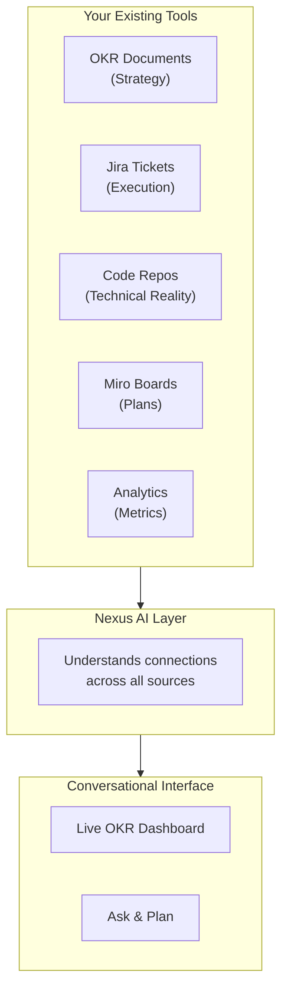
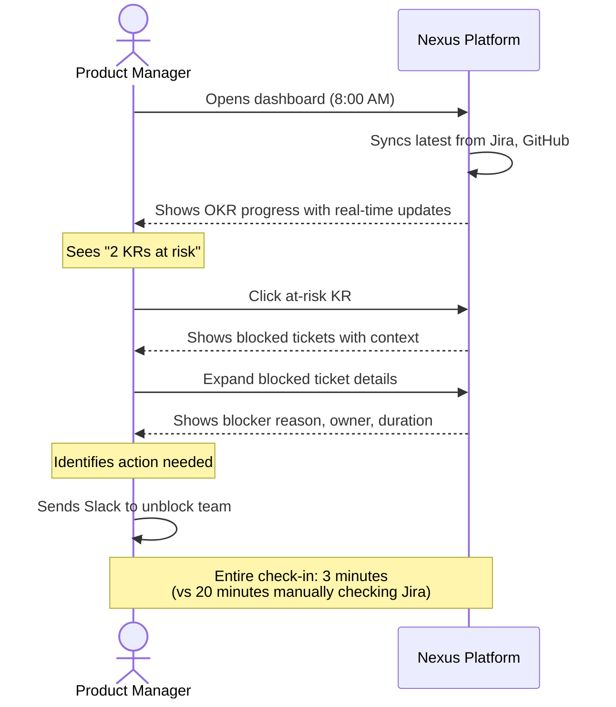
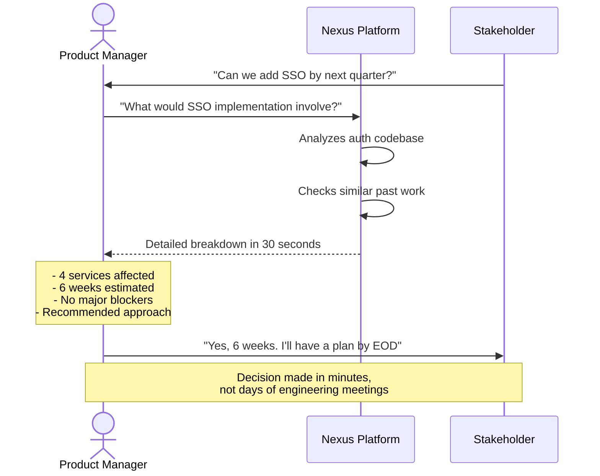
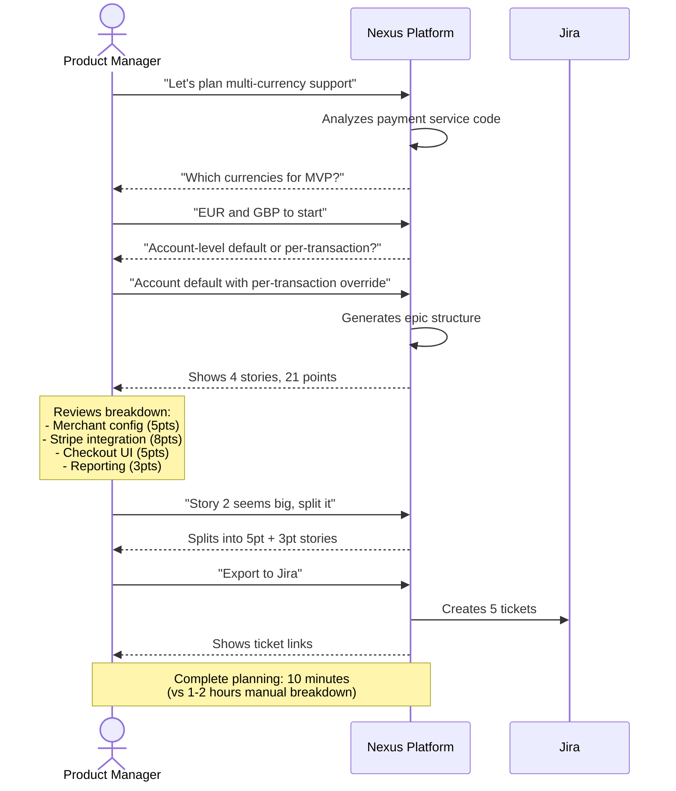

# Nexus: Vision Document

## The Problem

Product Managers are the connective tissue between strategy and execution. Yet they operate in a world of fragmented tools and disconnected information:

**Strategic artifacts live in isolation.** OKRs are locked in slide decks and documents. Roadmaps exist as static images in Miro. There's no live connection between "what we said we'd achieve" and "what we're actually building."

**Technical feasibility is a black box.** When a PM wants to know "Can we add feature X? How hard would it be?" - the answer requires scheduling meetings, waiting for engineering bandwidth, and often getting rough guesses rather than informed estimates. This creates bottlenecks and delays in decision-making.

**Planning is manual and error-prone.** Breaking down a feature into epics, stories, and tasks is time-consuming. PMs often miss edge cases that engineers would catch, leading to incomplete tickets that require rework and back-and-forth.

**Progress tracking is retrospective, not real-time.** By the time a PM realizes an OKR is at risk, it's often too late. The connection between daily ticket movement and quarterly objectives is maintained manually, if at all.

---

## The Vision

**Nexus** is an intelligent copilot that gives Product Managers superpowers by unifying their strategic context, execution data, and technical reality into a single conversational interface.

Imagine a PM who can:

- See at a glance how every ticket in flight maps to their OKRs
- Ask "What would it take to add SSO support?" and get a grounded answer in minutes, not days
- Break down a feature into well-structured tickets through a collaborative dialogue with an AI that actually understands the codebase
- Get early warnings when execution is drifting from strategy

This isn't about replacing PM judgment - it's about removing the friction that slows it down.

---

## What We're Building

### 1. Unified Context Layer

The tool ingests and connects information from across the PM's ecosystem:

| Source | What It Provides |
|--------|------------------|
| OKR Documents (PPT, Docs, PDF) | Strategic objectives, key results, success metrics |
| Miro / Visual Planning Tools | Roadmaps, user flows, architectural diagrams |
| Jira / Ticket Systems | Epics, stories, tasks, status, descriptions, history |
| Analytics Platforms | Usage data, funnel metrics, adoption numbers |
| Code Repositories | Service structure, APIs, dependencies, complexity |

This isn't just data aggregation - the AI understands the relationships between these artifacts and can reason across them.

---

### 2. OKR Progress Dashboard

A living view of strategic progress grounded in execution reality.

**Example Dashboard View:**

```
┌────────────────────────────────────────────────────────────────────────────────┐
│  PayFlow Q1 2025 OKRs                                    Last sync: 2m ago     │
├────────────────────────────────────────────────────────────────────────────────┤
│                                                                                │
│  ╔═══════════════════════════════════════════════════════════════════════╗    │
│  ║  SUMMARY METRICS                                                      ║    │
│  ╠═══════════════════════════════════════════════════════════════════════╣    │
│  ║  Overall Progress: 58%  │  At Risk: 2 KRs  │  Blocked: 3 tickets      ║    │
│  ║  Total Tickets: 40      │  Done: 24        │  In Progress: 11         ║    │
│  ╚═══════════════════════════════════════════════════════════════════════╝    │
│                                                                                │
│  ┌─ STATUS DISTRIBUTION ────┐  ┌─ SPRINT VELOCITY ─────────────────────┐     │
│  │                           │  │                                        │     │
│  │     Done: 24 (60%) ███    │  │  60 ┤                         ▓       │     │
│  │  In Prog: 11 (28%) ██     │  │  50 ┤            ▓       ▓    ░       │     │
│  │  Blocked:  3 (7%)  █      │  │  40 ┤     ▓      ░       ░    ░       │     │
│  │Not Start:  2 (5%)  █      │  │  30 ┤                                 │     │
│  │                           │  │     └─────────────────────────────    │     │
│  └───────────────────────────┘  │      S21   S22   S23   S24            │     │
│                                  │      ▓ Completed  ░ Planned           │     │
│                                  └────────────────────────────────────────┘     │
│                                                                                │
│  ◉ Objective 1: Improve payment success rate and reliability                  │
│    ├─ KR1: Increase payment success rate from 94% to 97%                      │
│    │   Progress: 75% ███████████████░░░░░  Current: 96.25% / Target: 97%     │
│    │   📊 12 tickets: 8 done • 3 in progress • 1 blocked                      │
│    │   ✅ Status: ON TRACK                                                    │
│    │                                                                           │
│    ├─ KR2: Reduce payment processing time from 2.5s to 1.5s                   │
│    │   Progress: 60% ████████████░░░░░░░░  Current: 1.9s / Target: 1.5s      │
│    │   📊 8 tickets: 5 done • 2 in progress • 1 not started                   │
│    │   ✅ Status: ON TRACK                                                    │
│    │                                                                           │
│    └─ KR3: Achieve 99.95% uptime for payment gateway                          │
│        Progress: 92% ██████████████████░░  Current: 99.93% / Target: 99.95%  │
│        📊 6 tickets: 5 done • 1 in progress                                   │
│        ✅ Status: ON TRACK                                                    │
│                                                                                │
│  ◉ Objective 2: Enable enterprise-grade security and compliance               │
│    ├─ KR1: Complete SOC 2 Type II certification                               │
│    │   Progress: 45% █████████░░░░░░░░░░░  Current: 45% / Target: 100%       │
│    │   📊 9 tickets: 2 done • 3 in progress • 2 blocked • 2 not started       │
│    │   ⚠️  Status: AT RISK                                                    │
│    │   🚫 SEC-204 blocked: Waiting for HR integration (4 days)                │
│    │                                                                           │
│    └─ KR2: Implement SSO for enterprise customers                             │
│        Progress: 30% ██████░░░░░░░░░░░░░░  Current: 30% / Target: 100%       │
│        📊 7 tickets: 1 done • 2 in progress • 1 blocked • 3 not started       │
│        ⚠️  Status: AT RISK                                                    │
│        🚫 AUTH-304 blocked: Dependency on user service refactor (3 days)      │
│                                                                                │
│  ◉ Objective 3: Scale merchant onboarding and activation                      │
│    ├─ KR1: Reduce time-to-first-transaction from 3 days to 1 day              │
│    │   Progress: 85% █████████████████░░░  Current: 1.3 days / Target: 1 day │
│    │   📊 10 tickets: 8 done • 2 in progress                                  │
│    │   ✅ Status: ON TRACK                                                    │
│    │                                                                           │
│    ├─ KR2: Increase merchant activation rate from 65% to 80%                  │
│    │   Progress: 20% ████░░░░░░░░░░░░░░░░  Current: 68% / Target: 80%        │
│    │   📊 4 tickets: 0 done • 1 in progress • 3 not started                   │
│    │   ⚠️  Status: BEHIND SCHEDULE                                            │
│    │                                                                           │
│    └─ KR3: Launch self-service onboarding portal                              │
│        Progress: 0% ░░░░░░░░░░░░░░░░░░░░  Current: 0% / Target: 100%         │
│        📊 0 tickets linked                                                    │
│        ⚠️  GAP: No execution items mapped to this KR                          │
│                                                                                │
└────────────────────────────────────────────────────────────────────────────────┘
```

**What the dashboard enables:**

- **Summary Metrics**: At-a-glance view of overall progress, risks, and ticket distribution
- **Visual Analytics**: Status distribution pie chart and sprint velocity trends
- **Auto-mapping**: Tickets to OKRs based on semantic understanding of descriptions
- **Real-time Progress**: Live calculation from ticket status across Jira boards
- **Risk Detection**: Automatically identifies blocked items, velocity drops, and scope issues
- **Gap Analysis**: Highlights OKRs with insufficient execution coverage
- **Drill-down**: Click any KR to see linked tickets, assignees, and detailed history

---

### 3. Code-Aware Chat Interface

A conversational interface where PMs can ask questions and get answers grounded in the actual codebase, tickets, and plans.

**Chat Window:**

```
┌────────────────────────────────────────────────────────────────────────┐
│  💬 Code-Aware Chat                                    [PayFlow]        │
├────────────────────────────────────────────────────────────────────────┤
│                                                                        │
│  [🤖 AI] Welcome! I have context of your codebase, Jira tickets,      │
│          and OKRs. Ask me about feasibility, impact, or status.       │
│                                                                        │
│  ─────────────────────────────────────────────────────────────────    │
│                                                                        │
│  [You] Can we add cryptocurrency payments? What would that involve?   │
│                                                                   10:23│
│                                                                        │
│  [🤖 AI] Based on the codebase analysis, adding cryptocurrency        │
│          payment support would be a significant undertaking.          │
│          Here's what it would involve:                           10:23│
│                                                                        │
│          AFFECTED COMPONENTS                                          │
│          • payment-service (src/services/payment/)                    │
│          • transaction-service (src/services/transaction/)            │
│          • accounting-service (src/services/accounting/)              │
│          • merchant-dashboard (src/apps/dashboard/)                   │
│                                                                        │
│          NEW INFRASTRUCTURE NEEDED                                    │
│          • Crypto wallet integration (Coinbase Commerce, BitPay)      │
│          • Real-time price conversion service                         │
│          • Blockchain transaction monitoring                          │
│          • Separate settlement flow (10+ min vs instant)              │
│                                                                        │
│          ESTIMATED EFFORT                                             │
│          • Engineering: 12-16 weeks for 2 engineers                   │
│          • Compliance review: 4-6 weeks                               │
│          • Total: ~5 months for MVP                                   │
│                                                                        │
│          💡 RECOMMENDATION                                            │
│          This is a major initiative requiring dedicated focus.        │
│          Validate demand with top 20 merchants first.                 │
│                                                                        │
│  [You] That's helpful. What's currently blocking the SSO work?        │
│                                                                   10:25│
│                                                                        │
│  [🤖 AI] Looking at the SSO epic (AUTH-301 to AUTH-304), there's      │
│          one blocker:                                            10:25│
│                                                                        │
│          🚫 AUTH-304: Implement JIT user provisioning                 │
│             Status: BLOCKED (3 days)                                  │
│             Assignee: Marcus Johnson                                  │
│             Blocker: "Dependency on user service refactor"            │
│             Related: USER-156 (in progress, due Sprint 25)            │
│                                                                        │
│          The user-service refactor is 60% complete. Looking at        │
│          the code:                                                    │
│                                                                        │
│          ┌──────────────────────────────────────────────┐             │
│          │ // src/services/user/userService.ts          │             │
│          │ // TODO: Update createUser() to support      │             │
│          │ // external identity providers               │             │
│          │ export async function createUser(data) {     │             │
│          │   // Current: email/password only            │             │
│          │   return User.create(data);                  │             │
│          │ }                                             │             │
│          └──────────────────────────────────────────────┘             │
│                                                                        │
│          💡 ACTION ITEM                                               │
│          Sync with Sarah (working on USER-156) to unblock Marcus.     │
│          Expected resolution: Sprint 24 (current sprint).             │
│                                                                        │
├────────────────────────────────────────────────────────────────────────┤
│  Type your question...                                  [Send]         │
└────────────────────────────────────────────────────────────────────────┘
```

**Example Conversation 1: Feasibility Check**

```
PM: Can we add dark mode to the customer dashboard?

AI: Based on the codebase analysis, here's what dark mode would involve:

AFFECTED COMPONENTS:
• Dashboard UI (src/components/dashboard/) - 23 components
• Design system tokens (src/styles/tokens.ts) - currently hardcoded colors
• Chart library (using Recharts) - would need theme prop updates

CURRENT STATE:
The app doesn't have a theming system. Colors are defined inline or in 
scattered CSS files. There's no CSS variable infrastructure.

ESTIMATED EFFORT:
• If we add a proper theming system first: 2-3 weeks (recommended)
• If we do a quick pass with CSS overrides: 1 week (tech debt)

DEPENDENCIES:
• No backend changes required
• Would need design assets for dark color palette

Do you want me to break this down into a detailed epic structure?
```

**Example Conversation 2: Impact Analysis**

```
PM: We're thinking of deprecating the /api/v1/users endpoint. 
    What would break?

AI: I found 3 internal services and the mobile app consuming this endpoint:

INTERNAL CONSUMERS:
1. notification-service (src/services/notifications/userLookup.ts)
   - Calls GET /api/v1/users/{id} for user preferences
   - 847 calls/day average

2. billing-service (src/services/billing/customerSync.ts)  
   - Calls GET /api/v1/users?email={email} for customer matching
   - 2,100 calls/day average

3. analytics-pipeline (jobs/daily_user_export.py)
   - Bulk export via GET /api/v1/users with pagination
   - Runs nightly

EXTERNAL CONSUMERS:
• Mobile app v2.3 and below still uses this endpoint
• Based on analytics, ~12% of mobile users are on these versions

RECOMMENDATION:
Consider a 90-day deprecation window with v2 migration path. 
The billing-service dependency is the most complex to migrate.
```

**Example Conversation 3: Quick Context**

```
PM: What's the status of the checkout redesign work?

AI: Here's the current state of checkout redesign:

EPIC: PROJ-1234 "Checkout Flow Redesign"
Status: In Progress (Sprint 23)

BREAKDOWN:
✓ 5 stories completed (62 story points)
→ 2 stories in progress
  • PROJ-1245: Payment method selection (Dev: Sarah, Day 3)
  • PROJ-1247: Order summary component (Dev: Mike, blocked)
○ 3 stories not started (34 story points)

BLOCKERS:
PROJ-1247 is blocked waiting for design specs for the 
gift card redemption flow. Last comment was 4 days ago.

RELATED OKR:
This epic maps to KR2: "Reduce cart abandonment from 67% to 50%"
Currently that KR shows 45% progress.
```

---

### 4. Interactive Planning Mode (Unified with Chat)

Planning isn't a separate mode - it's a natural extension of the conversation. When you say "let's plan this out," the AI seamlessly enters planning mode within the same chat interface, asking clarifying questions conversationally and generating tickets inline.

**Example Planning Flow:**

```
┌────────────────────────────────────────────────────────────────────────┐
│  💬 Ask + Plan                                          [PayFlow]        │
├────────────────────────────────────────────────────────────────────────┤
│                                                                        │
│  [You] Can we add multi-currency support for international merchants? │
│                                                                   10:23│
│                                                                        │
│  [🤖 AI] Let me analyze the codebase for multi-currency support.      │
│                                                                   10:23│
│          ┌─────────────────────────────────────────────────────────┐  │
│          │ FEASIBILITY ANALYSIS                                    │  │
│          │                                                          │  │
│          │ CURRENT STATE                                           │  │
│          │ • payment-service handles USD only (hardcoded)          │  │
│          │ • Stripe integration already supports multi-currency    │  │
│          │ • Database schema has currency field but unused         │  │
│          │                                                          │  │
│          │ ESTIMATED EFFORT: 4-6 weeks with 2 engineers            │  │
│          │                                                          │  │
│          │ 💡 Very feasible. Stripe does the heavy lifting.        │  │
│          └─────────────────────────────────────────────────────────┘  │
│                                                                        │
│  [You] That sounds doable. Let's plan this out.                       │
│                                                                   10:25│
│                                                                        │
│  [🤖 AI] ╭─ Planning: Multi-Currency Support ─╮                       │
│          │ Status: Gathering requirements     │                       │
│          ╰────────────────────────────────────╯                       │
│                                                                        │
│          Great! A few questions to scope this properly:               │
│                                                                        │
│          ┌─────────────────────────────────────────────────────────┐  │
│          │ ❓ Which currencies should we support for MVP?          │  │
│          │                                                          │  │
│          │ Based on merchant requests, I see EUR, GBP, CAD, AUD,   │  │
│          │ and JPY are most requested.                             │  │
│          │                                                          │  │
│          │ (Supporting fewer initially = faster delivery)          │  │
│          └─────────────────────────────────────────────────────────┘  │
│                                                                        │
│  [You] Start with EUR and GBP. We can add more later.                 │
│                                                                   10:26│
│                                                                        │
│  [🤖 AI] Got it - EUR and GBP for MVP. Keeps scope tight.            │
│                                                                   10:26│
│          ┌─────────────────────────────────────────────────────────┐  │
│          │ ❓ For currency selection, should merchants set a       │  │
│          │    default at account level, or choose per-transaction? │  │
│          │                                                          │  │
│          │ Looking at your settings pattern in                     │  │
│          │ src/apps/dashboard/settings/, you have account-level   │  │
│          │ configs we could extend.                                │  │
│          └─────────────────────────────────────────────────────────┘  │
│                                                                        │
│  [You] Account-level default, but allow override per transaction.     │
│                                                                   10:27│
│                                                                        │
│  [🤖 AI] Perfect - default with override. Based on our discussion:   │
│                                                                   10:27│
│          ╭─ Planning: Multi-Currency Support ─╮                       │
│          │ Status: Complete                   │                       │
│          ╰────────────────────────────────────╯                       │
│                                                                        │
│          ┌─────────────────────────────────────────────────────────┐  │
│          │ EPIC: Multi-Currency Payment Support (MVP)              │  │
│          │ 4 stories • 21 points • Links to KR 3.1                 │  │
│          │                                                          │  │
│          │ ▸ Story 1: Merchant currency configuration     (5 pts) │  │
│          │ ▸ Story 2: Multi-currency payment processing   (8 pts) │  │
│          │ ▸ Story 3: Currency selection in checkout      (5 pts) │  │
│          │ ▸ Story 4: Multi-currency reporting            (3 pts) │  │
│          │                                                          │  │
│          │ [📤 Export to Jira] [✏️ Refine] [🔗 Link to OKR]        │  │
│          └─────────────────────────────────────────────────────────┘  │
│                                                                        │
│  [You] Story 2 seems big. Can you split it?                           │
│                                                                   10:28│
│                                                                        │
│  [🤖 AI] Sure! I'll split Story 2 into two smaller pieces:           │
│                                                                   10:28│
│          ┌─────────────────────────────────────────────────────────┐  │
│          │ STORY SPLIT                                             │  │
│          │                                                          │  │
│          │ ✕ Multi-currency payment processing (8 pts)            │  │
│          │                                                          │  │
│          │ + Stripe multi-currency integration (5 pts)            │  │
│          │ + Payment flow currency handling (3 pts)               │  │
│          │                                                          │  │
│          │ [📤 Export to Jira] [✏️ More Changes]                   │  │
│          └─────────────────────────────────────────────────────────┘  │
│                                                                        │
│  [You] Looks good. Export to Jira.                                    │
│                                                                   10:29│
│                                                                        │
│  [🤖 AI] ✅ Successfully created in Jira:                            │
│                                                                   10:29│
│          ┌─────────────────────────────────────────────────────────┐  │
│          │ ✓ Created in Jira                                       │  │
│          │                                                          │  │
│          │ EPIC: PAY-520                                           │  │
│          │                                                          │  │
│          │ PAY-521 - Merchant currency configuration               │  │
│          │ PAY-522 - Stripe multi-currency integration             │  │
│          │ PAY-523 - Payment flow currency handling                │  │
│          │ PAY-524 - Currency selection in checkout                │  │
│          │ PAY-525 - Multi-currency reporting                      │  │
│          │                                                          │  │
│          │ [🔗 View in Jira] [📅 Add to Sprint]                     │  │
│          └─────────────────────────────────────────────────────────┘  │
│                                                                        │
├────────────────────────────────────────────────────────────────────────┤
│  Type your message...                                      [Send]      │
└────────────────────────────────────────────────────────────────────────┘
```

**Key Design Principles:**

- **No separate planning page** - Planning is a mode within the chat, not a different screen
- **Natural language answers** - Respond conversationally, not by clicking options
- **Context preservation** - Feasibility analysis flows naturally into planning
- **Inline artifacts** - Generated epics appear in the chat, expandable for details
- **Iterative refinement** - Keep chatting to adjust: "split story 2", "add error handling task"
- **Action buttons** - Export to Jira, refine, link to OKR appear when relevant

---

## The Opportunity

### The Cost of Fragmentation

Every day, PMs lose hours to:
- **Context switching** between strategy docs, Jira boards, and engineering discussions
- **Manual status tracking** that's outdated the moment it's compiled
- **Waiting for engineering** to answer "can we build this?" questions
- **Incomplete planning** that leads to scope creep and rework

These aren't just inefficiencies—they're barriers to making good decisions quickly.

### What Changes with Nexus

**PMs become decision machines:**
- Answer feasibility questions in real-time during stakeholder meetings
- Spot at-risk objectives before they become fire drills
- Generate well-scoped tickets without engineering bottlenecks
- Stay in strategic mode instead of reactive coordination mode

**Engineering gets better inputs:**
- Tickets that already consider technical constraints
- Clear connection between their work and business outcomes
- Less time in meetings explaining "why this is hard"
- More time building, less time clarifying

**Organizations gain execution intelligence:**
- Know which strategies are actually being built
- See where engineering capacity is really going
- Identify gaps between stated goals and actual work
- Make data-driven decisions about priorities

### The Bigger Picture

This isn't about replacing PM judgment—it's about removing the friction that slows it down.

When technical feasibility isn't a black box, when strategic progress is always current, and when planning is assisted by AI that understands your codebase, PMs can focus on what they do best: understanding customers, defining strategy, and driving outcomes.

**The result:** Better products, shipped faster, with less organizational overhead.

---

## How It Works

Nexus connects to your existing PM ecosystem and uses AI to understand the relationships between strategy, code, and execution:



The platform ingests information from across your PM workflow, understands the semantic relationships between different artifacts, and provides a single conversational interface to access this unified knowledge.

---

## User Flows

### Flow 1: Morning Check-In



### Flow 2: Quick Feasibility Check



### Flow 3: Feature Planning Session



---

## The Impact

### Time Savings

**Before Nexus:**
- Daily standup context gathering: 20-30 minutes
- Feasibility research for feature requests: 2-3 days
- Epic/story breakdown: 1-2 hours per feature
- OKR progress tracking: 1-2 hours weekly

**With Nexus:**
- Morning check-in: 3-5 minutes
- Feasibility answer: 30 seconds to 2 minutes
- Feature planning: 10-15 minutes
- OKR tracking: Real-time, always current

**Net Result:** ~8-10 hours saved per week per PM

### Decision Quality

- **Grounded in reality**: Technical estimates based on actual code, not guesses
- **Complete picture**: See connections between strategy and execution automatically
- **Early risk detection**: Know about blockers before they become critical
- **Better scoping**: AI helps identify edge cases and dependencies

### Strategic Focus

By removing execution friction, PMs can spend more time on:
- Customer discovery and validation
- Market analysis and competitive research
- Product strategy and roadmap planning
- Stakeholder alignment and communication

**The goal**: Let PMs be strategists, not project coordinators.

---

## Experience the Vision

An interactive demo has been built to showcase Nexus in action. The demo simulates the complete experience using realistic data from "PayFlow", a fintech payment platform.

### What You Can Explore

**OKR Dashboard**
- See real-time progress across 3 objectives and 8 key results
- View visual analytics with charts and trends
- Drill down into blocked work and at-risk initiatives
- Understand how 40+ tickets map to strategic goals

**Conversational Interface**
- Ask about feasibility: "Can we add multi-currency support?"
- Check on status: "What's blocking the SSO work?"
- Plan new features: "Let's plan adding Apple Pay support"
- Refine plans conversationally: "Split that story into smaller pieces"
